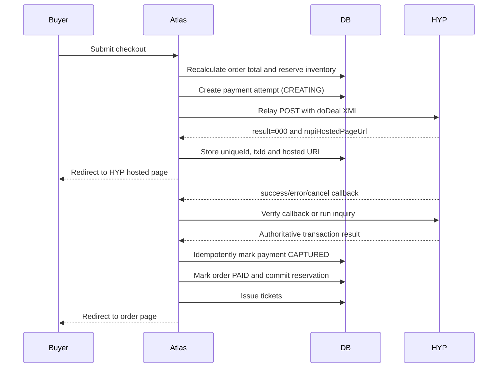
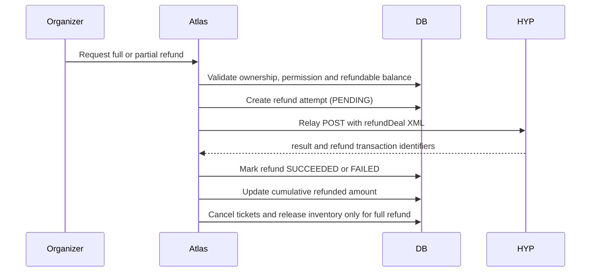

# Atlas One - HYP Payment Architecture v2

## Scope

This branch rebuilds the complete HYP money flow without changing Production until the Preview flow is verified.

The implementation must cover:

1. Server-side price calculation.
2. Payment attempt creation.
3. HYP Relay `doDeal` request.
4. Hosted payment page redirect.
5. Success, error and cancel callbacks.
6. Callback verification and inquiry fallback.
7. Idempotent order finalization.
8. Ticket issue and email delivery.
9. Full and partial `refundDeal` operations.
10. Reconciliation, audit logs and retry safety.

## Source of truth

GitHub is the code source of truth. HYP is the financial source of truth. Atlas must never mark a payment or refund as completed only because the browser returned to a success URL.

## Required server environment variables

- `HYP_RELAY_URL`
- `HYP_API_USER`
- `HYP_API_PASSWORD`
- `HYP_TERMINAL_NUMBER`
- `HYP_MPI_MID`
- `NEXT_PUBLIC_APP_URL`

Legacy variables such as `HYP_MASOF`, `HYP_PASSP`, `HYP_API_KEY` and `HYP_TEMPLATE` must not be used by the v2 Relay client unless HYP explicitly confirms that a specific value is still required.

No HYP secret may use a `NEXT_PUBLIC_` prefix.

## Payment flow

## Payment identifiers

Atlas must store separately:

- Atlas order public ID.
- Atlas payment attempt ID.
- HYP `uniqueId`.
- HYP `txId`.
- HYP `cgUid`.
- HYP `tranId`, when available.
- HYP response code.
- Amount in minor units.
- Currency.

Random fallback values must never be stored as HYP transaction references.

## Amount rules

Atlas stores and calculates money in integer minor units.

- 100 ILS = `10000` minor units.
- The amount sent to HYP must equal the server-calculated order total.
- The callback or inquiry amount must exactly match the expected payment attempt amount.
- Client-supplied totals are never trusted.

## Callback rules

A browser callback is not sufficient proof of payment.

Atlas must:

1. Resolve the payment attempt by an Atlas-controlled unique identifier.
2. Verify the HYP response MAC when supported.
3. Run inquiry when the callback is incomplete or ambiguous.
4. Compare status, amount, currency and identifiers.
5. Finalize the order exactly once.
6. Treat repeated callbacks as idempotent success.

## Refund flow

## Refund rules

- Use HYP `refundDeal`, not legacy `CancelTrans`.
- Partial refunds must send `total` in minor units.
- The cumulative refunded amount may never exceed the captured amount.
- Every refund request requires an idempotency key.
- Every HYP refund transaction must be stored as a separate record.
- A full refund cancels tickets and releases inventory only after HYP confirms success.
- A partial refund does not automatically cancel the entire order.

## Required safeguards

- Permission and organization ownership checks.
- Atomic database finalization.
- Idempotent payment and refund processing.
- Structured audit log.
- No secrets in logs.
- No database mutations during Vercel build.
- No Production merge before Preview testing.

## Verification checklist

- Payment page creation succeeds.
- Hosted URL is returned by HYP.
- Success callback finalizes one order exactly once.
- Duplicate callback creates no duplicate tickets.
- Cancel callback releases reservation without marking PAID.
- Incorrect amount is rejected.
- Invalid response verification is rejected.
- Full refund succeeds and cancels tickets.
- Partial refund succeeds and leaves remaining refundable balance.
- Duplicate refund request is idempotent.
- HYP and Atlas balances reconcile.
